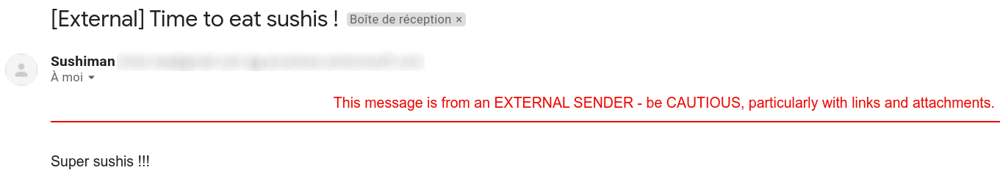
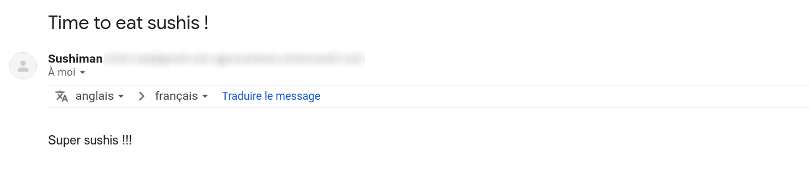

# OCTO Gmail Enhancer 

Cette extension permet de simplifier l'affichage du Gmail d'OCTO/ACN en supprimant le "bruit".

# I. Installation

Commencer par télécharger l'extension :

* Se rendre sur la page des [releases](https://github.com/vnea/octo_gmail_enhancer/releases) pour télécharger la version
  souhaitée.
* Désarchiver l'archive.

En cas d'installation d'une nouvelle version, supprimer l'ancienne version avant d'installer la nouvelle.

## Google Chrome

* Ouvrir l'application `Google Chrome`.
* Se rendre sur l'URL: <chrome://extensions/>.
* Activer le mode `Mode développeur` (en haut à droite).
* Cliquer sur le bouton `Charger l'extension non empaquetée` et sélectionner le dossier désarchivé.

Attention : à cause de la politique Accenture, si vous êtes connecté avec votre compte Accenture sur l'application
Google Chrome, il ne sera pas possible d'installer des extensions dont celle-ci. L'alternative est d'utiliser un autre
navigateur ou tout simplement de ne pas se connecter avec son compte Accenture.

# II. Features

## 1. Suppression des occurrences de "external" dans l'objet de chaque email sur la page d'accueil

### Sans l'extension

### Avec l'extension

## 2. Suppression de l'occurence "external" dans l'objet quand le mail est ouvert

### Sans l'extension

### Avec l'extension

## 3. Suppression de l'occurence "external" en haut du mail quand il est ouvert

### Sans l'extension

### Avec l'extension

