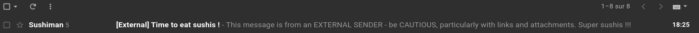
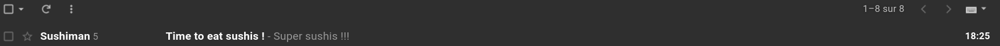
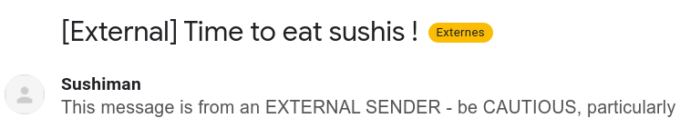
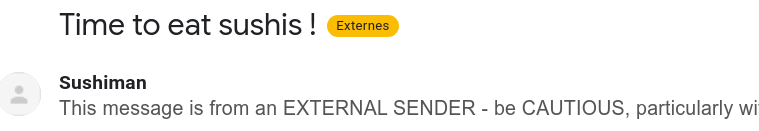

# OCTO Gmail Enhancer

Cette extension permet de supprimer les choses inutiles sur le Gmail d'OCTO/ACN.

# I. Installation

Commencer par télécharger l'extension :

* Se rendre sur la page des [releases](https://github.com/vnea/octo_gmail_enhancer/releases) pour télécharger la version
  souhaitée.
* Désarchiver l'archive.

## Google Chrome

* Ouvrir l'application `Google Chrome`.
* Se rendre sur l'URL: <chrome://extensions/>.
* Activer le mode `Mode développeur` (en haut à droite).
* Cliquer sur le bouton `Charger l'extension non empaquetée` et sélectionner le dossier désarchivé.

# II. Features

## 1. Suppression des occurrences de "external" dans l'objet de chaque email sur la page d'accueil

### Sans l'extension

### Avec l'extension

## 2. Suppression de l'occurence "external" dans l'objet quand le mail est ouvert

### Sans l'extension

### Avec l'extension

